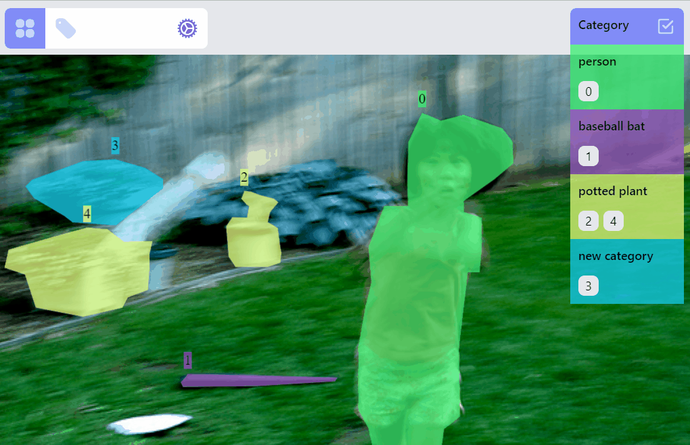

# react-annotate


Play with the [demo](https://react-annotate-demo.vercel.app/)

## Install

```bash
npm install @zityspace/react-annotate
```

## Get started

Simple example to annotate bounding boxes:

```tsx
import { Annotator, ImageData } from '@zityspace/react-annotate';

const Example = () => {
  // fake a batch (or one page) of annotations fetched from an api or a local file
  const imagesListRaw = [
    {
      name: '000000261061.jpg',
      height: 334,
      width: 500,
      url: 'http://images.cocodataset.org/val2017/000000261061.jpg',
      annotations: [
        {
          category: 'person',
          x: 260.16,
          y: 41.7,
          w: 111.51,
          h: 292.3,
        },
        {
          category: 'baseball bat',
          x: 132.41,
          y: 229.89,
          w: 112.82,
          h: 9.4,
        },
        {
          category: 'potted plant',
          x: 164.96,
          y: 98.06,
          w: 39.82,
          h: 54.85,
        },
      ],
    },
    // more images with annotations as above
  ];

  const imagesList: ImageData[] = imagesListRaw.map((image) => ({
    ...image,
    annotations: image.annotations.map((box) => ({ ...box, type: 'box' })),
  }));

  return (
    <Annotator
      imagesList={imagesList}
      initIndex={0}
      onSave={async (image: ImageData) => {
        console.log(image);
        return true;
      }}
      onError={(msg: string, context: any) => {
        console.log(msg, context);
      }}
      onAddCategory={async (category: string) => {
        console.log('add new category ', category);
        return true;
      }}
      onRenameCategory={async (
        oldName: string,
        newName: string,
        timestamp?: string
      ) => {
        console.log(oldName, ' -> ', newName, ' @ ', timestamp);
        return true;
      }}
    />
  );
};
```

The classes you will use are `Annotator`, `ImageData`.

Typically, the whole process is first fetch a batch of annotations with image meta information and annotations on each image, then transform the annotations on each image into interested labels, and lastly feed them into the `Annotator`, there you get a nice UI for annotation. The complete props for `Annotator` are:

```typescript
{
  imagesList: ImageData[];
  initIndex?: number;
  categories?: string[];
  getImage?: (imageName: string) => Promise<string> | string;
  onSave: (curImageData: ImageData) => Promise<boolean> | boolean;
  onError?: (message: string, context?: any) => void;
  onAddCategory: (category: string) => Promise<boolean> | boolean;
  onRenameCategory: (
    oldCategory: string,
    newCategory: string,
    timestamp?: string
  ) => Promise<boolean> | boolean;
  labelConfigs?: LabelConfigs;
}
```

You can either specify url for each image, or pass in a `getImage()` function, which uses the image name to request the image blob and then return `URL.createObjectURL(imageBlob)`. It is also recommended to pass in `categorie` of the whole dataset to `Annotator`. Otherwise it will be infered from `imagesList`, which is only one batch of annotations thus the infered `categories` is not complete.

**Import:** _react-annotate is only an annotation ui component, it does not contain the logic to persist the changes of annotations. Therefore you need to implement `onSave()`, `onAddCategory()` and `onRenameCategory()`, typically api calls to your backend, to persist the changes. Otherwise, after loading a new batch of annotations, the changes on previous batch will be lost. Switching to the prev/next image and if current image annotation has been changed, it will trigger `onSave()`; when adding a new category or renaming a category, it will trigger `onAddCategory()` and `onRenameCategory()`. The optional `onError()` handles the failure of loading an image._

Other related types/interfaces are:

```typescript
interface ImageData {
  name: string;
  width?: number;
  height?: number;
  annotations: Annotations;
  url?: string;
  [k: string]: unknown;
}

type Annotations = ((
  | {
      type: 'point';
      x: number;
      y: number;
    }
  | {
      type: 'line';
      x1: number;
      y1: number;
      x2: number;
      y2: number;
    }
  | {
      type: 'box';
      x: number;
      y: number;
      w: number;
      h: number;
    }
  | {
      type: 'polyline';
      paths: { x: number; y: number }[][];
    }
  | {
      type: 'mask';
      paths: {
        points: { x: number; y: number }[];
        closed?: boolean;
        hole?: boolean;
      }[];
    }
  | {
      type: 'keypoints';
      keypoints: { x: number; y: number; vis: boolean; sid: number }[];
    }
) & {
  category: string;
  timestamp?: string;
  hash?: string;
})[];

interface LabelConfigs {
  keypoints?: { skeleton: [number, number][] };
}
```

## How to annotate

### Selections / filters

Select/filter one or multiple labels: click on the label, or a category, or ids. The selected category is persisted so when switching to other images, only labels of selected category are in preview or selected mode.


### Category ops

Update category of a label:


Create a new category for selected label:


Delete a category:


Rename a category:



### Label ops

Operations on `PointLabel`, `LineLabel`, `BoxLabel` are straightforward:


Operations on `PolylineLabel` and `MaskLabel` are more complicated, both of them supporting "AI mode", Currently AI mode is just using opencv's intelligentScissor to find lines, it maybe helpful for `PolylineLabel` but not so much for `MaskLabel`, we will soon integrate/enable related AI predictions into the annotation process based on label types.

#### `PolylineLabel` ops

- drawing: `polyline:draw` listener group
  - right click will delete previous point
  - switch on/off AI mode
  - double click will stop drawing


- editing: `polyline:edit` listener group
  - right click will delete a point
  - right click on point A, hold and release on point B will delete segments A-to-B or {lineStart-to-A, B-to-lineEnd} depending on it is case lineStart-A-B-lineEnd or it is case lineStart-B-A-lineEnd, in later case the polyline will be break into sub-polylines as intermediate state
  - double click on a point will switch to advanced drawing mode


- advanced drawing: `polyline:draw:advanced` listener group
  - click on the endpoint of a polyline or sub-polyline will start extending it, otherwise it will start drawing a new sub-polyline
  - double click will stop extending, if it is double clicked on an endpoint of another sub-polyline, then two sub-polylines will be merged


#### `MaskLabel` ops

`MaskLabel` has two properties `closed`, `hole`. A hole closed path encircled by a non-hole closed path will become a mask with hole.

- drawing: `mask:draw` listener group
  - right click will delete previous point
  - double click will stop drawing, if it is double clicked on the starting point, then form a closed mask, otherwise form an open path


- editing: `mask:edit` listener group
  - right click will delete a point
  - right click on point A, hold and release on point B will delete segments A-to-B or {lineStart-to-A, B-to-lineEnd}
  - double click on a point will switch to advanced drawing mode


- advanced drawing: `mask:draw:advanced` listener group
  - right click on a point will reverse hole property of the path
  - left click on a point of a closed path, of a point that is not the endpoint of an open path, then no response
  - left click on an endpoint of open path will start extending it
  - click not on a point will start drawing a new path, with hole property true if right click and false if left click
  - double click will stop extending, if it is double clicked on an endpoint of another path, then two paths will be merged


## Limitations

The design of this library tries to strike a balance between the optimization of the annotation experience for each label type, and the consistency of the implementations among all the label types. Currently this leads to certain limitations:

- Touch screen is not supported
- Display on small screen is not optimized
- The library is based on [fabricjs](https://github.com/fabricjs/fabric.js), which limits the label types and certain interactions. However, we are not limited in terms of what to use underhood, as we integrate more labels, we might bring in other lower level dependancies best suited for that label type.

## License

Apache 2.0 © [ZitySpace](https://github.com/ZitySpace)
